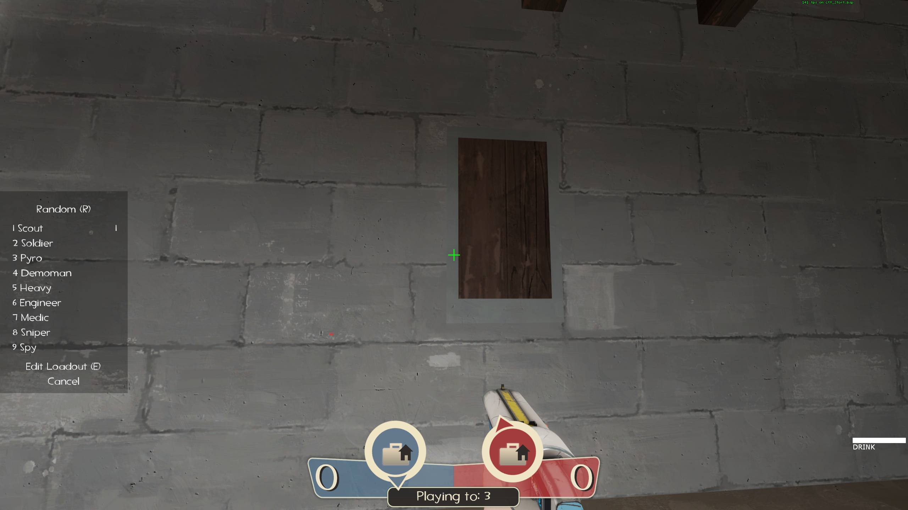

# Minimal Class Selection HUD



> ### _Only changes the class selection screen._

Due to the removal of the `extendfreeze` command, I'm trying a modified version of [KBNHud's (by Jotunn)](https://gamebanana.com/mods/26847) minimal class selection screen.

The changes that I made to KBNHud's class selection UI:

- Anchor to the left of the screen to get it out of the way
- Swap the custom fonts to built-in fonts
- Refactor hardcoded x/y position values for relative positions to group the core stuff
- Disable visibility for offscreen elements

This is meant to only be used with TF2's default HUD as a minimal change, rather than worked into another custom HUD. I don't use custom HUDs, and I made this for myself.

## Positioning the box around the screen

Currently, it's anchored to the top-left of the screen so that chat text is still visible while in the class selection screen. The trade-off is that it now overlaps with the Engineer's buildings HUD.

If you want to move the box around, you (now) only need to move the position of the `"MainBG"` element in the `classselection.res` file and the `classselection_sc.res` file (I don't know what the `_sc` file is used for but I've been maintaining parity for the overlap.)

For example, this changes the `ypos` from `0` to `100`:

```diff
"MainBG"
{
  "ControlName" "ImagePanel"
  "fieldName" "MainBG"
  "xpos" "0"
-  "ypos" "0"
+  "ypos" "100"
  "zpos" "-1"
  "wide" "120"
  "tall" "190"
  "autoResize" "0"
  "pinCorner" "0"
  "visible" "1"
  "enabled" "1"
  "fillcolor" "0 0 0 127"
}
```

You could try anchoring it to the right side of the screen below the killfeed.

[Read more about positioning here.](https://github.com/JarateKing/TF2-Hud-Reference/blob/master/1-APPENDIX/Positioning.md)

## Download

[Download the ZIP](https://github.com/rufio-tf2/minimal-class-selection-hud/archive/refs/heads/main.zip) of this repo and extract the ZIP.

## Install

Navigate to your `tf` folder. If you've chosen a custom location for your Steam folder, then you know where it is. If you used the default install path, then it should be:

- Windows: `C:\Program Files (x86)\Steam\steamapps\common\Team Fortress 2\tf\`
- macOS: `~/Library/Application Support/Steam/SteamApps/common/team fortress 2/tf/`
- Linux: `~/.steam/steam/SteamApps/common/Team Fortress 2/tf/`

You can also:

1.  Right click TF2 in your Steam library
1.  Click Properties
1.  Go to the "Local Files" tab
1.  Click the "Browse Local Files..." button
1.  Open the `tf` folder

### Move HUD folder

To install these files, open the `custom` folder that's inside of the `tf` folder. If `custom` doesn't exist, just create it.

1.  Navigate into `tf/custom/`
1.  Move the `minimal-class-selection-hud` folder that you extracted from the ZIP previously into `tf/custom/`

You should now have this HUD located at `tf/custom/minimal-class-selection-hud`.

Restart TF2 and everything should work.

## Disclaimers

- I'm a noob at making HUDs. I don't use custom HUDs, and I haven't cared about them until this workaround for extending spectate.
- If anyone sees opportunities to clean up more of the original KBNHud stuff, please let me know.

## Thanks

- [@Jotunn](https://gamebanana.com/members/1247574) for making a HUD with a super clean, minimal class selection screen.
- [@JarateKing](https://github.com/JarateKing) for the [TF2-Hud-Reference](https://github.com/JarateKing/TF2-Hud-Reference) docs.
